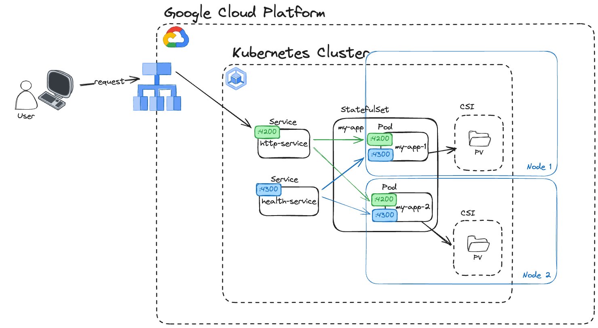

# Revolut DevOps Test

Welcome to the Revolut DevOps Test.

## Requirements

- [Rust](https://www.rust-lang.org/tools/install) - The application is written
  in Rust programming language. To build the application, you need to have the Rust
  compiler installed on your machine.
- [Docker](https://docs.docker.com/get-docker/) - The application provides a Dockerfile
  to build the application in a Docker container. You can use Docker to build and
  run the application in a container.
- [Helm](https://helm.sh/docs/intro/install/) - The project provides a Helm
  chart to deploy the application to Kubernetes. You need to have Helm installed
  on your machine to render the Kubernetes manifests of deploy the application.

## Local development

### Building

To build the project, run the following command:

```bash
cargo build
```

This will build the application in `debug` mode. The produced executable will be
stored at `./target/debug/revolut-devops-test`.

To build the application in `release` mode, run the following command:

```bash
cargo build --release
```

The produced executable can be found at `./target/release/revolut-devops-test`.

### Running

It is not required to build the project before running the application. You can
run the following command to build and run the applciation:

```bash
cargo run
```

After the application finishes compiling, it will start the http servers and can
accept the requests. You should see the output similar to the following:

<!-- markdownlint-disable MD013 -->
```text
2024-06-19T17:21:26.693899+02:00 INFO surrealdb_core::kvs::ds: Starting kvs store at speedb://.local/data
2024-06-19T17:21:26.719369+02:00 INFO surrealdb_core::kvs::ds: Started kvs store at speedb://.local/data
2024-06-19T17:21:26.721120+02:00 INFO revolut_devops_test::setup::http: Listening http server on [::1]:4200
2024-06-19T17:21:26.721285+02:00 INFO revolut_devops_test::setup::http: Listening health server on [::1]:4300
```
<!-- markdownlint-enable MD013 -->

This means that the application has started successfully and is ready to accept
the requests.

You can now send the request to check if everything works as expected:

<!-- markdownlint-disable MD013 -->
```bash
curl -X PUT -H "Content-Type: application/json" "http://[::1]:4200/hello/foo" -d '{"dateOfBirth": "2000-01-01"}'
```
<!-- markdownlint-enable MD013 -->

This should not produce any output. You can check the response status code by adding
`-v`  flag to the curl command.

We can also try to call the `GET` endpoint to see if the previous request was stored
the data correctly:

```bash
curl "http://[::1]:4200/hello/foo"
```

This should return the output similar to the following:

```json
{ "message": "Hello, foo! Your birthday is in 196 day(s)" }
```

### Testing

To run the tests, run the following command:

```bash
cargo test
```

## Docker

The application also provides docker support. This allows deploying the application
to Kubernetes or any other container orchestration platform.

To build the docker image, run the following command:

```bash
docker build -t revolut-devops-test .
```

> [!TIP]
> If you are building the docker image on the M1 Mac, you might need to use the
> `--platform linux/amd64` flag to build the image for the `amd64` architecture.
> Some of the dependencies used in the application do not support the `arm64`
> architecture.
>
> ```bash
> docker build --platform linux/amd64 -t revolut-devops-test .
> ```

Now you can run the docker container:

```bash
docker run -p 4200:4200 -p 4300:4300 revolut-devops-test
```

## Configuration

**Cli options**:

- `-h` - Print help message summary
- `--help` - Print more detailed help message
- `-a | --bind-address` - The address to bind the http server to (default: `[::1]:4200`)
- `--health-bind-address` - The address to bind the health server to (default: `[::1]:4300`)
- `-l | --log-level` - Log level for the application (default: `info`)
- `--log-encoder` - The format of the log output. It can be either `text` or `json`
  (default: `text`)
- `-d | --data-dir` - The directory to store the data (default: `.local/data`)

It is also possible to configure the application using the environment variables.
To do so, add the `REVOLUT_` prefix to the cli option name, use uppercase letters
and replace the `-` with `_`. For example, to set the log level, you can use the
`REVOLUT_LOG_LEVEL` environment variable.

## Deployment

The application provides the Helm chart to deploy the application to Kubernetes.

To deploy the application, it is recommended to use automated deployment tools such
as ArgoCD or FluxCD. For the testing purposes we can use the Helm CLI.

To render the final Kubernetes manifests, run the following command:

```bash
helm template -f helm/revolut-devops-test/values.yaml revolut-test helm/revolut-devops-test
```

We can deploy the application to the Kubernetes cluster. If you don't have a cluster
that you can use, there is a Terraform module in the `infra/` directory that can
be used to create the GKE cluster. The module will also create the Google Container
Registry to store the docker images. **Go to the [`infra/`](./infra/README.md)
directory and follow the instructions there.**

Now, that you have the Kubernetes cluster ready, you can build and push the docker
image. Run the following commands:

```bash
export VERSION=v0.1.0
export IMAGE="$REGISTRY/revolut-devops-test"
docker build -t "$IMAGE:$VERSION" .
docker push "$IMAGE:$VERSION"

echo "image:
  repository: $IMAGE
  tag: $VERSION" > helm/demo.local.yaml
```

Now, you can deploy the application to the Kubernetes cluster. Run the following
command:

```bash
helm install revolut-test helm/revolut-devops-test \
  --namespace revolut-demo \
  --create-namespace \
  -f helm/demo.local.yaml
```

## Storage

The application uses [SurrealDB](https://surrealdb.com/) as a storage backend. To
run the application, there are no dependencies required. The application will start
the storage backend automatically.

> [!NOTE]
> The current implementation of the storage backend doesn't support running multiple
> instances of the application at the same time. Which was one of the requirements
> of the assignment. The reason for this limitation is the choice of the storage
> backend used in the application. It is possible to tweak the code to support
> it, but it will require running the [TiKV](https://tikv.org/) or [FundationDB](https://www.foundationdb.org/)
> on separate instances.
>
> Running the storage backend on a separate instance will require additional
> configuration and will increase the complexity of the deployment.
>
> I would not recommend running such simple application with such specialized database.
> It would be better to use a managed database provided by the cloud provider.

By default, the application will store the data in the `.local/data` directory,
relative to the application working directory. To change the storage directory,
use the `--data-dir` cli option or the `REVOLUT_DATA_DIR` environment variable.

> [!IMPORTANT]
> For the sake of the demonstration, I have ingored the fact that the storage backend
> doesn't support running multiple instances of the application at the same time.
> I have created the helm chart to deploy the application as if it was supported.
> We can assume that the application synchronizes the data between the instances
> internally.

## Observability

The application provides the following observability features:

- **Logging** - Logs are written to the standard output and can be formatted as
  `text` or `json`. The default format is `text`. It is recommended to use the
  `json` format for structured logs when running the application in the cloud
  for better integration with the observability tools.
- **Metrics** - The application exposes the Prometheus metrics on the `/metrics`
  endpoint served on `4300` port by default.
- **Tracing** - The application supports a simple MDC-based tracing mechanism.
  The trace ID is generated for each request and can be found in the logs.
  Additionally, the trace ID can be passed in the `X-Request-ID` header to propagate
  the trace ID between the services.
- **Health check** - The application exposes the health check endpoint on the
  `/health` endpoint served on `4300` port by default.

## Repository structure

- `src/` - The source code of the application.
  - `setup/` - This directory contains all the initialization logic to start all
    the required services and tools. Such as the storage backend, logger and the
    http server.
  - `app/` - The main application logic. This directory contains the implementation
    of the http endpoint handlers and the business logic.
- `helm/` - The directory with the Helm chart to deploy the application to Kubernetes.
- `infra/` - The directory with the infrastructure as code to deploy the application
  to GCP.

## System diagram

This diagram shows the infrastructure to run the application on Google Cloud Platform
using the Kubernetes Engine.



## Final notes

There are a few things that I didn't have time to implement and should be part of
the final solution:

### CI

The repo contains the minimal github actions configuration.
It builds and tests the application on each push to the `main` branch or the PRs.
I would however extend the configuration to include the following:

- The builds running on `main` should produce the docker image and push it to
  `ghcr.io` where it can be used by the deployment pipeline.
- The builds running on the PRs should run block the PR from merging if the tests
  are failing.

### CD

For more reliable deployment, I would use ArgoCD with Argo Rollouts to ensure the
deployment process is smooth and provides the ability to update the application
with zero downtime and small impact on the users.
